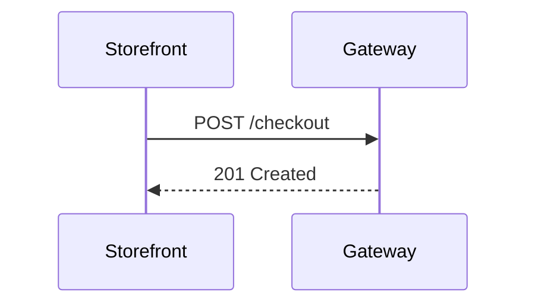

# orders-service

Handles checkout, order state and payment capture for the storefront.

## Checkout flow


```mermaid
sequenceDiagram
  participant S as Storefront
  participant G as Gateway
  S->>G: POST /checkout
  G-->>S: 201 Created
```

## Try it locally

```bash
curl -X POST localhost:8080/orders
```
